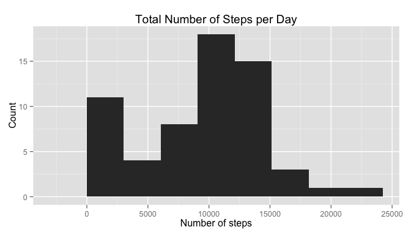
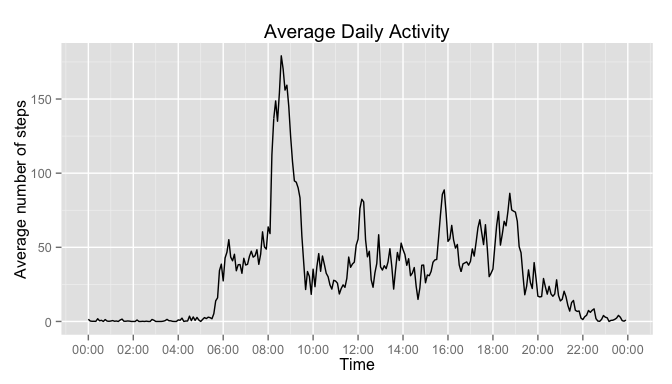
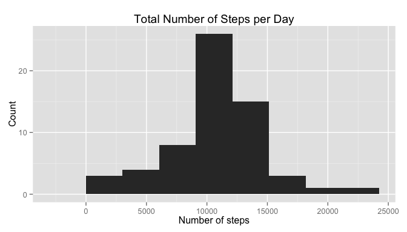
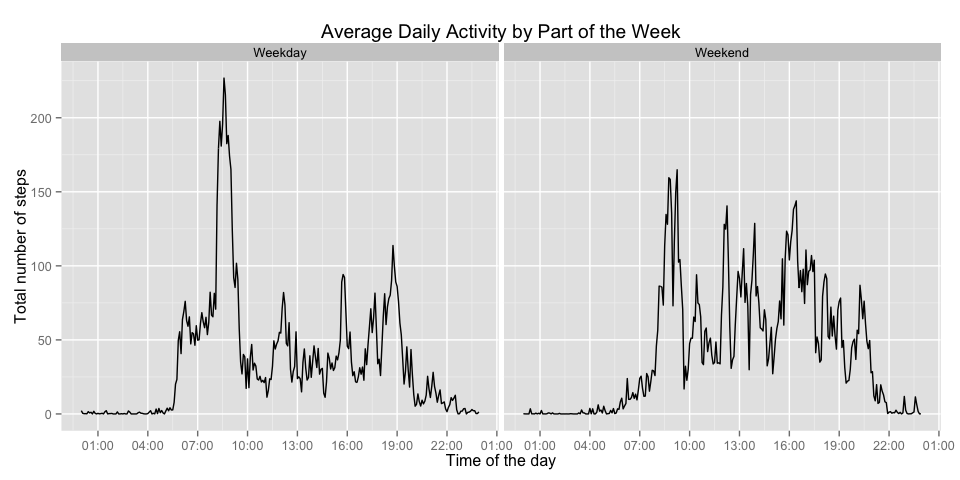

# Reproducible Research: Peer Assessment 1


<style type="text/css">
.table {
    width: 40%;
}
</style>

Load all libraries used in the script.


```r
library(knitr)
library(lubridate)
library(dplyr)
library(ggplot2)
library(scales)
```

First we set the options to make sure we always show the code and the output.

```r
opts_chunk$set(echo="TRUE", results="asis")
```


### Loading and preprocessing the data

To get the data we unzip the data file stored in the current working directory and load it.


```r
unzip('activity.zip') # this contains 'activity.csv' file
activity_raw <- read.csv('activity.csv')
```

Then we combine date and interval information to create a timestamp for the activity data.


```r
activity <- activity_raw
# Turn the date and time into a timestamp
activity$interval <- sprintf("%04d", activity$interval) # pad the times with leading 0s
# combine date and time:
timestamp <- paste(activity$date,activity$interval)
activity$timestamp <- parse_date_time(timestamp,"ymd_hm")
```


### What is mean total number of steps taken per day?

We calculate the total number of steps taken per day, using dplyr package functions.


```r
activity_bydate <- group_by(activity, date)
steps_bydate <- summarise(activity_bydate, total_steps=sum(steps, na.rm=TRUE))
```


Now we make a histogram of the total number of steps taken each day. That is we plot the distribution of steps taken.


```r
# Calculate the range of the total steps
steps_minmax <- range(steps_bydate$total_steps, na.rm=TRUE)
steps_range <- steps_minmax[2] - steps_minmax[1] # this is used to adjust the binwidth

ggplot(data=steps_bydate, aes(total_steps)) + geom_histogram(binwidth=steps_range/7) + 
    xlab('Number of steps') + ylab('Count') + ggtitle('Total Number of Steps per Day')
```

 

Calculate and report the mean and median of the total number of steps taken per day.


```r
steps_mean <- mean(steps_bydate$total_steps,na.rm=TRUE)
steps_median <- median(steps_bydate$total_steps,na.rm=TRUE)
```

The mean number of steps taken per day was 9354.23, while the median was 10395.


### What is the average daily activity pattern?

Calculate the average number of steps taken in each 5-minute interval averaged across all days.


```r
activity_byinterval <- group_by(activity, interval)
num_days <- length(unique(activity$date))
steps_byinterval <- summarise(activity_byinterval, avg_steps=sum(steps, na.rm=TRUE)/num_days)
```

Make a time series plot of average daily activity.


```r
intervals <- strptime(steps_byinterval$interval, format="%H%M") # this is more useful than timestamp variable

ggplot(data=steps_byinterval, aes(x = intervals, y = steps_byinterval$avg_steps)) + geom_line() + scale_x_datetime(breaks="2 hours", labels = date_format("%H:%M")) + xlab('Time') + ylab('Average number of steps') + ggtitle('Average Daily Activity')
```

 

Which 5-minute interval, on average across all the days in the dataset, contains the maximum number of steps?


```r
# the interval variable gives the time when the interval starts
max_interval1 <- steps_byinterval$interval[which.max(steps_byinterval$avg_steps)]
# here we get the time it ended
max_interval2 <- steps_byinterval$interval[which.max(steps_byinterval$avg_steps) + 1]
max_time1 <- paste(substr(max_interval1,1,2),':',substr(max_interval1,3,4),sep="")
max_time2 <- paste(substr(max_interval2,1,2),':',substr(max_interval2,3,4),sep="")
```

The 5-minute interval, which on average contains the maximum number of steps is 08:35 - 08:40.


### Imputing missing values

Let's count the number of missing values in the dataset.


```r
num_nas <- sum(is.na(activity$steps))
```

The activity data contains 2304 missing values.

Looking at how NAs are distributed by date, it appears that data for some days are completely missing. Therefore, taking the mean of the day to impute missing values would not be meaningful. Under the assumption that activity is relatively stable across different days in particular time periods, we can fill in missing values by taking the average for the corresponding 5-minute interval.


```r
# with(activity, table(is.na(steps), date)) # to check how NAs are distributed by date
activity_clean <- activity

na_indx <- which(is.na(activity_clean$steps)) # indices where there's NA
for (i in 1:length(na_indx)) {
    # which interval we need to replace
    intvl <- activity_clean$interval[na_indx[i]]
    # which value to replace with
    activity_clean$steps[na_indx[i]] <- steps_byinterval$avg_steps[steps_byinterval$interval==intvl] 
}
```

Make a histogram of the total number of steps taken each day after the missing values have been imputed.


```r
# Summarize clean data
activity_bydate_clean <- group_by(activity_clean, date)
steps_bydate_clean <- summarise(activity_bydate_clean, total_steps=sum(steps))

# Make a new plot
ggplot(data=steps_bydate_clean, aes(total_steps)) + geom_histogram(binwidth=steps_range/7) + 
    xlab('Number of steps') + ylab('Count') + ggtitle('Total Number of Steps per Day')
```

 

Calculate the mean and median of the clean dataset after imputing missing data.


```r
steps_mean_clean <- mean(steps_bydate_clean$total_steps)
steps_median_clean <- median(steps_bydate_clean$total_steps)
```

What is the impact of imputing missing data on the estimates of the total daily number of steps?


```r
# Combine statistics into a table
stats <- rbind(c(steps_mean, steps_median), c(steps_mean_clean, steps_median_clean))
rownames(stats) <- c('With NAs', 'Imputed NAs')
colnames(stats) <- c('Mean','Median')

kt <- kable(stats)
print(kt, type="html")
```

                   Mean   Median
------------  ---------  -------
With NAs        9354.23    10395
Imputed NAs    10581.01    10395

As can be seen from this table imputing missing data had no effect on the median of the total number of steps per day but it slightly increased the mean.


### Are there differences in activity patterns between weekdays and weekends?

Create a new factor variable in the dataset with two levels – “weekday” and “weekend” indicating whether a given date is a weekday or weekend day. Use weekdays() function and the clean dataset.


```r
activity_clean$weekday <- weekdays(activity_clean$timestamp)
activity_clean$day <- factor(activity_clean$weekday %in% c("Saturday","Sunday"), labels=c("Weekday", "Weekend"))
```

Calculate the average number of steps taken in each 5-minute interval, averaged separately across all weekday days and weekend days.


```r
activity_byweekday <- group_by(activity_clean, day)
activity_byinterval <- group_by(activity_byweekday, interval, add=TRUE) # add a second grouping layer
steps_byweekday <- summarise(activity_byinterval, avg_steps=mean(steps))
```

Make a panel plot containing average daily activity for weekday days and weekend days. 


```r
intervals <- strptime(steps_byweekday$interval, format="%H%M")
ggplot(data=steps_byweekday, aes(x = intervals, y = avg_steps)) + geom_line() + scale_x_datetime(breaks="3 hours", labels = date_format("%H:%M")) + facet_wrap(~day) + xlab("Time of the day") + ylab("Total number of steps") + ggtitle('Average Daily Activity by Part of the Week')
```

 

